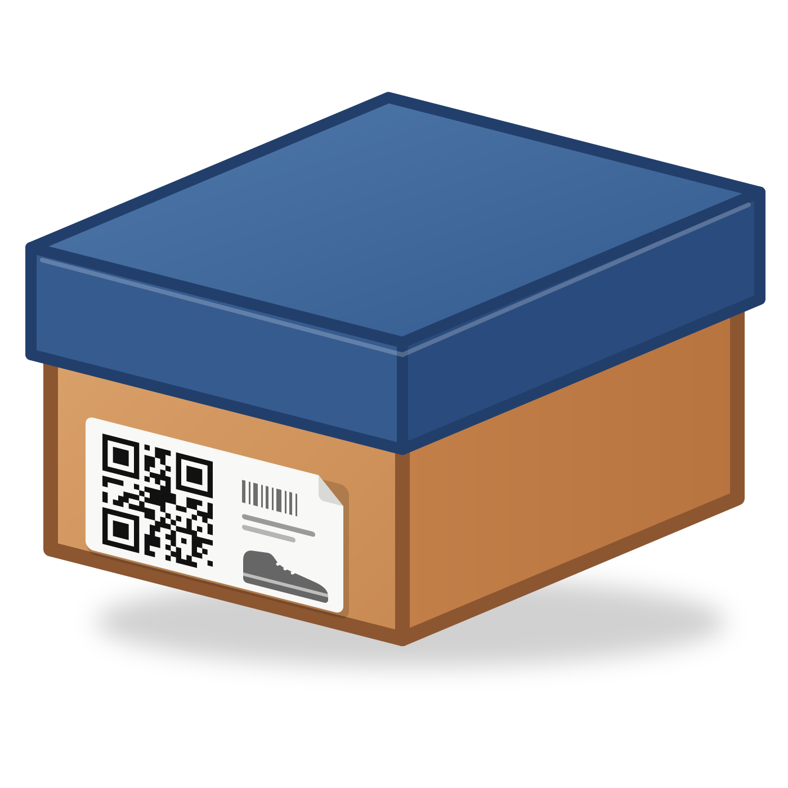
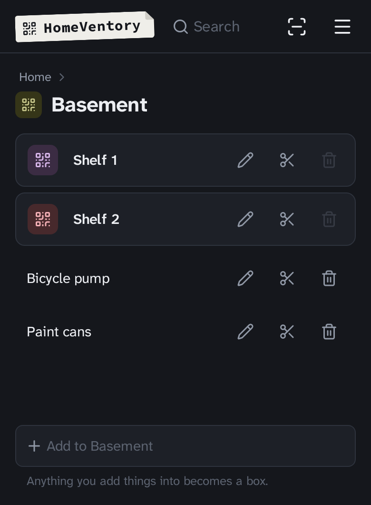
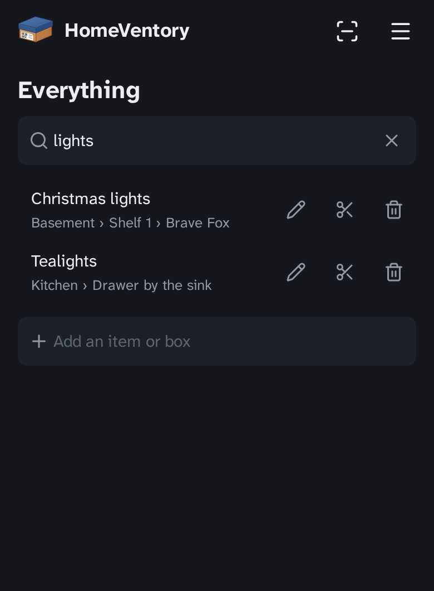
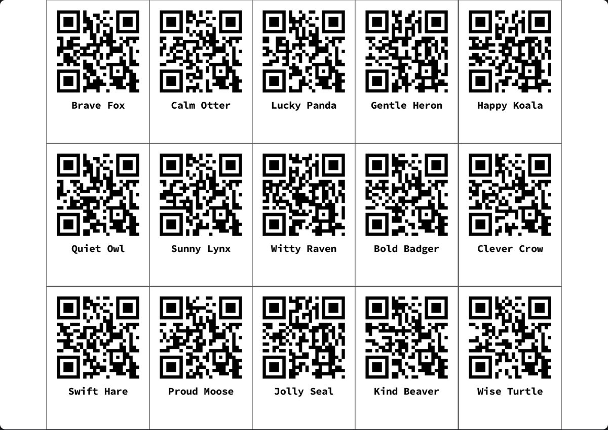

<div align="center">



# DavidHomeVentory

**Know what's in every box without opening it.**

Self-hosted home inventory. Stick a QR code on a box, scan it, see what's inside.

[](LICENSE.md)





</div>

## Features

- **Nested boxes**: boxes hold items and other boxes, as deep as you like.
- **Search**: find any item and see its full location, e.g. `Basement / Shelf 1 / Brave Fox`.
- **QR stickers**: print sticker sheets; scanning a new sticker creates its box.
- **Move things**: cut a box and paste it elsewhere; its contents move with it.
- **Android app and PWA**: `davidhomeventory://` QR links open the app directly.
- **Lightweight**: one Node.js process and a SQLite file. No accounts, no cloud.

<div align="center">

</div>

## Quick start

Requires Docker with `docker-compose`.

```sh
git clone https://github.com/fxdave/DavidHomeVentory.git
cd DavidHomeVentory
make install    # generates back/.env, installs, migrates, builds
make prod-start # http://localhost:3001
```

The port is set in `compose.prod.override.yml` (gitignored, created by `make install` from `compose.prod.override.yml.sample`).

Open the app, enter `http://<server>:3001/api` and a password. **The first password entered becomes the server password.**

Update with `make prod-update`, stop with `make prod-stop`.

### Android app

Requires the Android SDK.

```sh
make build-front-apk     # APK in front/android/app/build/outputs/apk/
make install-front-apk   # or install on a connected device
```

## Development

```sh
make start      # frontend :3000 (Vite), backend :3001 (nodemon)
```

React, Vite, Panda CSS, Capacitor · Express, [Cuple](https://github.com/fxdave/cuple), Prisma, SQLite.

## License

[GPLv3](LICENSE.md)

<a href="https://endsoftwarepatents.org/innovating-without-patents"></a>
